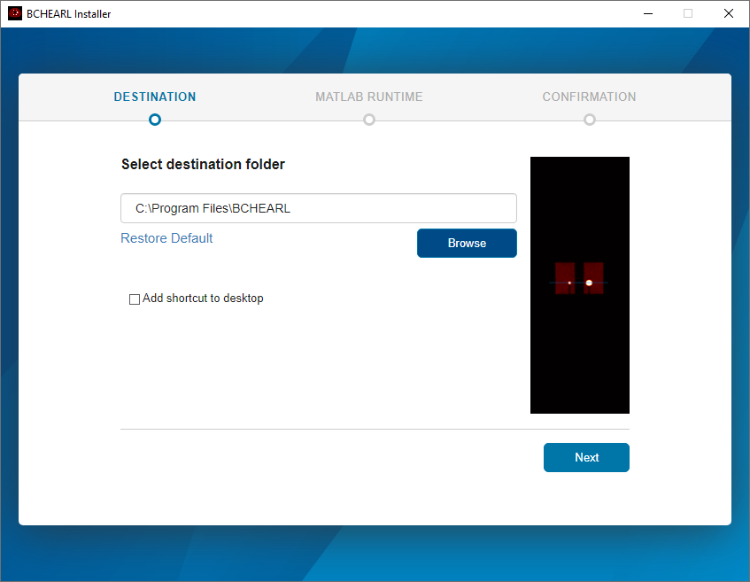

# User guide

## Installing

*BCH EARL* is distributed through Windows executable files. The current version is developed by [MATLAB App Designer](https://ww2.mathworks.cn/products/matlab/app-designer.html), thus it requires a [MATLAB runtime](https://ww2.mathworks.cn/products/compiler/matlab-runtime.html) of a certain version.

## Calculating with GUI

## Gaussian filtering

## Calculating with task file
