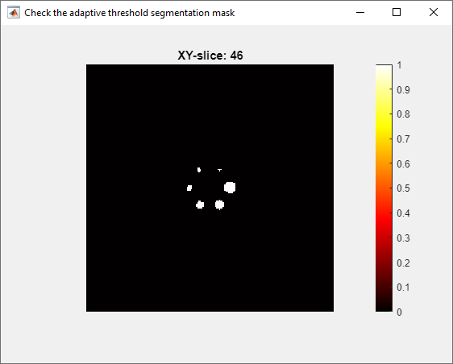

# User guide

## Installing

*BCH EARL* is distributed through Windows executable files.


The current version is developed by [MATLAB App Designer](https://ww2.mathworks.cn/products/matlab/app-designer.html), thus it requires a [MATLAB runtime](https://ww2.mathworks.cn/products/compiler/matlab-runtime.html) of a certain version.

!!! note "Offline installation"

    By default, the (high quality) internet connection is required to download the MATLAB runtime. When installing offline, you may need to prepare the corresponding runtime manually and specify the runtime folder.

    

Apart from this, the installation process shall be smooth.

## Calculating with GUI

Upon successful installation, you can see run the application.


The **Menu** is on the top. Below it are two panels. The **Left Panel** contains several groups that go through the whole workflow, namely **Load Parameters**, **ROI Tool**, and the **Quantification**. The **Right Panel** conatins the **Figure Area**, the **Reference Standard Option**, and the **Color Scale**.

### Specify the working directory

It is highly recommended to set the working directory before each run. To do so, use the menu `File`>`Specify working directory`. The default directory when the program is started is `%UserProfile%\Documents\MATLAB`.

### Specify the phantom filling parameters

To specify the filling doses, filling volumes, and filling times, press `Parameter loader` to start a new app window.


If strictly adhered to the official BCH EARL imaging protocol (to be released later) and used the official record form (to be released later), the items shall be readily at hand. Otherwise, you may need to make some compromise.

Once provided all necessary data, you may press `Done` to accept the values. Or you can `Save` the data to a `.mat` binary file, to be later loaded using the `Load existed` button. This binary file can also be used in the [task file](#calculating-with-task-file).

### Import the DICOM series

Next, the DICOM series of the PET image of the phantom is imported. First click on the `DICOM import` button, and choose *any one DICOM file* in the folder. Then, the whole series will be loaded. The center coronal slice will be visualized at the **Figure Area**.


The `Parallel` checkbox is enabled by default, which means the loading process is using the [parallel feature](#parallel). You may uncheck it when necessary.

You can adjust the `Color scale` on the lower right corner of the right panel. The effect of the color scale is global.

!!! note "Color scale<a name="colorscale"></a>"

    The `Color scale` is in an arbitrary unit and affects the visualization of most of the color map images in this program.

### Obtain a preliminary ROI

!!! tip "Concept of the preliminary ROI"

    Although it is not very hard to implement an fully-automatic sphere-locating algorithm, I still chose to use the semi-automatic way for stability and to raise alert. The **preliminary ROI** is drawn over the *central slice* and is used as the *initial range* in the final (adaptive 50% isocontour) VOI segmentation.
    
    In this program, I use **(preliminary) ROI** to denote the 2D circles defined by the users, and use **VOI** to denote the automatically segmented 3D spheres.

    Thus, it is recommended to drag the radius of the ROI to be *slightly larger* than the radius of the corresponding sphere.

To draw a new preliminary ROI, press `Draw/modify ROI` button. This button is only enabled when both the phantom dose parameters and the DICOM series are properly loaded. A new window will pop up, and you can adjust the ROIs with mouse.


!!! note "Interacting with the 3D slice viewer<a name="viewer3D"></a>"

    A **3D slice viewer** is a MATLAB [figure window](https://www.mathworks.com/help/matlab/ref/figure.html) to visualize 3D images. The basic functions are:

    - **Mouse scrolling**: scroll through consecutive layers of the image.
    - `Save as`/`Copy as Image`/`Copy as Vector Graphic`: MATLAB figure window function.
    - `Pan`: MATLAB figure window function.
    - `Zoom In`: MATLAB figure window function.
    - `Zomm Out`: MATLAB figure window function.
    - `Restore View`: MATLAB figure window function.

The axial slices of the DICOM series are presented in this **3D slice viewer** window. ROIs corresponding to the six spheres (10 mm, 13 mm, 17 mm, 22 mm, 28 mm, and 37 mm diameter) will appear. First scroll the mouse to locate the slice at the center of the spheres, and drag the ROIs with mouse to the corresponding spheres. You can adjust the radius of each ROI circle by dragging the perimeter when the ROI is activated. You can take the advantage of the `Zoom In` function. You can also adjust the [**Color scale**](#colorscale).

When the ROI is readily adjusted, you can close the window. A dialog will ask you to confirm the ROI selection. Both the slice and the ROIs will be recorded.

Then, press the `Confirm ROI` button. The slice on which the ROIs were drawn will be shown in the **Figure Area**. Meanwhile the concentration ratio between the spheres and the background body is shown on the interface.


You are advised to always save the manually defined **preliminary ROIs** and the corresponding slice number to a binary file with `Save ROI` button. You can later reload it with `Load existing ROI` button.

### Segment and calculate the RCs

Once the ROIs have been confirmed, the `Segmentation` button is enabled. Press the button and the spheres will be segmented. Currently, only the 50% threshold segmentation via the region growth algorithm (holes filled) is supported, using the highest value point in the ROI as the seed. The threshold for the $i$-th VOI is $T_i$ is defined by the following equations.

$$\require{boldsymbol}
\begin{eqnarray}
\Omega_i &:=& \textrm{The sphere mask defined by the i-th preliminary ROI}   \\
M_\Omega(\theta) &=& 1 (\theta \in \Omega); 0 (\theta \notin \Omega)\\
T_i &=& C_{background}+50\%\times\left(\max{\{M_{\Omega_i}(\boldsymbol{I})\cdot \boldsymbol{I}\}-C_{background}}\right)
\end{eqnarray}$$

where $C_{background}$ is the background concentration at the reference time point (Bq/mL), and $\boldsymbol{I}$ is the concentration derived from the image at the same reference time point (Bq/mL). $\boldsymbol{I}$ is voxelized.

!!! note "Segmentation failure"

    If the contrast of the sphere is too low, the segmentation may fail. Please [refresh](#refresh) the program and try another image.

After completion, the segmented spheres will be shown in the **Figure Area**.


If the `Show segmented 3D mask` checkbox is selected, a [**3D slice viewer**](#viewer3D) will show the segmented mask. Users can check if the segmented regions are as expected.



Then, press `Calculate`. The recovery coefficients (RCs) will be calculated, including $\mathrm{RC_{mean}}$, $\mathrm{RC_{max}}$, and $\mathrm{RC_{peak}}$. A plot will be updated in the **Figure Area**, with the specified `Reference standard`.


The blue line indicates $\mathrm{RC_{mean}}$; the orange line indicates $\mathrm{RC_{max}}$; and the purple line $\mathrm{RC_{peak}}$. An upward triangle means the point is over the higher limit of the reference standard, while a downward triangle means the opposite.

!!! note "$\mathrm{RC_{peak}}$"

    There are difference definitions of $\mathrm{SUV_{peak}}$, thus the $\mathrm{RC_{peak}}$ is also ambiguous.

    $$
    \require{boldsymbol}
    \newcommand{\oiiint}{ {\subset \! \supset} \llap{\iiint} }
    \begin{eqnarray}\\
    \overrightarrow{\theta^\max_i} &=& \underset{\overrightarrow{\theta}}{\operatorname{arg max }} M_{\Omega_i}(\boldsymbol{I})\\
    \Omega_i^P(\overrightarrow{\theta}) &:=& \{||\overrightarrow{\theta}-\overrightarrow{\theta^\max_i}||<r\}, r=6.2\textrm{ mm} \\
    \mathrm{RC}_{\mathrm{peak}, i}  &=& \frac{\oiiint \Omega^P_i(\overrightarrow{\theta})\mathrm{d}\overrightarrow{\theta}}{C_{\mathrm{sphere}}}
    \end{eqnarray}$$

    Explanation: $\overrightarrow{\theta^\max_i}$ is the vector corresponding to the maximum point of in spherical VOI $\Omega_i$. $\Omega_i^P(\overrightarrow{\theta})$ is the spherical VOI whose volume is 1 cm<sup>3</sup>. $C_{\mathrm{sphere}}$ is the concentration of radionuclide in the spheres (Bq/mL).

    There is a problem with this algorithm. If the image is severely influenced by the Gibbs effect and $\overrightarrow{\theta^\max_i}$ is located close to the surface of the sphere, then the volume $\Omega_i^P(\overrightarrow{\theta})$ would contain a significant portion of the background, resulting in the abnormally lower $\mathrm{RC_{peak}}$.

### Export the results

Now, the plot and the values are ready to be exported. Press `Save figure` to export the plot. Press `Save value` to export the data to an ASCII file.

## Gaussian filtering

You can apply the Gaussian filter and save the filtered image using the Gaussian filter function, with `File`>`Gaussian Filter`.


!!! note "Reconstruct unfiltered images"

    I recommend the users to reconstruct unfiltered images, and apply Gaussian filtering with *BCH EARL*.

    Due to differences in implementation, the filtered images generated by *BCH EARL* and applied in the postprocessing step of image reconstruction are not bit-by-bit equivalent. However the developer has tested some cases, they are "close enough".

First, load the original DICOM file using `Load DICOM` button. The axial slice will be shown. To use the [parallel](#parallel) function, enable the `Parallel` checkbox.


Then, you can specify the FWHM of the Gaussian filter. You can also specify the filter size (kernel size). Select the `auto` checkbox, and the kernel size $k$ will be calculated using the following equation.

$$
k = 2\times\operatorname{ceil}(3\times\frac{\mathrm{FWHM}}{\sqrt{8\times\log 2}})+1
$$


The filtered image should be saved to a new series. Use the `Save DICOM` button. This button will generate a new folder in the same level as the original DICOM folder, but this new series will have a new series number. You can also specify the folder name.  To use the [parallel](#parallel) function, enable the `Parallel` checkbox.

## Calculating with task file

Once you have performed the analysis using the GUI with your new dataset, you can then perform batch jobs using a json task file.

To do this, you need to first edit the task file using your favorite text editor, save it with the extension of `.json`, and select this file through `File`>`Load task file`. Then, plots and values will be generated and exported automatically.

The whole process is illustrated in the following chart.


### The json task file template explained

The task file must have the extension of `.json` and must follow the [JSON](https://www.json.org/) convention.

!!! note "Validation of the JSON file"

    It is important to ensure the format validity of the JSON task file. You may use a JSON formatter to check it. You can find many related tools on the internet.

A demonstrative task file can be found in the [demo data](./DemoData.md). And below is a simplified version.

```json
{
    "Demo":[
        {
            "Work Path":"D://BCHEARL_Demo",
            "isParallel":1,
            "Data Dir":"NOT_DIAGNOSTIC_offline3D",
            "Fill Data":"./demoFillData.mat",
            "Mask File":"./demoROI.mat",
            "Mask Layer":0,
            "Gaussian":0,
            "Ref Standard":"EARL2",
            "Figure Path":"./",
            "Result Path":"./"
        }
    ]
}
```

Explanation:

- The **instance name** here is `"Demo"`.
- All fields are compulsory in all instances. Do not omit any of them.
- `"Work Path"` is the [working directory](#specify-the-working-directory). It should be an absolute path for clarity.
- `"isParalllel"` specifies if the [parallel](#parallel) function is used.
- `Data Dir"` is the path to the DICOM series data to be analyzed. It can be either a relative or an absolute path, but it has to be the folder.
- `"Fill Data"` is the path to the binary file for the phantom parameters [previously generated](#specify-the-phantom-filling-parameters). It can be either a relative or an absolute path.
- `"Mask File"` is the path to the binary file for the **preliminary ROIs** [previously generated](#obtain-a-preliminary-roi). It can be either a relative or an absolute path.
- `"Mask Layer"` is the layer of the center slice. Use `0` for the automatically determined layer (valid in most cases), or an integer for a self-defined value.
- `"Gaussian"` is the FWHM of the Gaussian filter in mm. If the value is `0`, the filtering step is omitted.
- `"Ref Standard` is the reference standard on the RC plots. It can be either `"EARL1"` or `"EARL2"`, and other strings will result in no reference standard.
- `"Figure Path"` is the path to the image file to be exported. It can be either a relative or an absolute path. If the path is a folder, the **instance name** is used as the file name, and `.png`  is used as the extension name. If the string is void, no image file will be exported. You will receive a warning if neither the image nor the value is exported.
- `"Result Path"` is the path to the ASCII file to be exported. It can be either a relative or an absolute path. If the path is a folder, the **instance name** is used as the file name, and `.csv` is used as the extension name. If the string is void, no image file will be exported. You will receive a warning if neither the image nor the value is exported.

!!! note "Windows path convention"

    Use `/` or `\\` as the path separator. Do not use the system default `\`, because it is an escape character.

## Other functions

### Parallel

The parallel computing function is provided through MATLAB. Generally, this feature may accelerate the loading and saving of multiple DICOM files. However, there are some side effects.

!!! note "Risks of parallel"

    - The starting of the parallel pool can be very slow.
    - The memory management of parallel has [bugs](#refresh).

### Refresh

`File`>`Refresh` will refresh the program, setting most functions and variables to the default status.

The `Parallel` check box is not affected. The working directory is not affected either.

!!! note "Free RAMs"

    Due to a problem with the [parallel](#parallel) feature of MATLAB, the RAM may not be able to be freed without restarting the program. Refreshing the program will not help to release the RAM in such cases.

### About

`Help`>`About` prints the information about the program, including the license.

### Help

`Help`>`Help` points to the [help page](https://mengxiangxi.info/Link/BCH_EARL.html) for this program.
